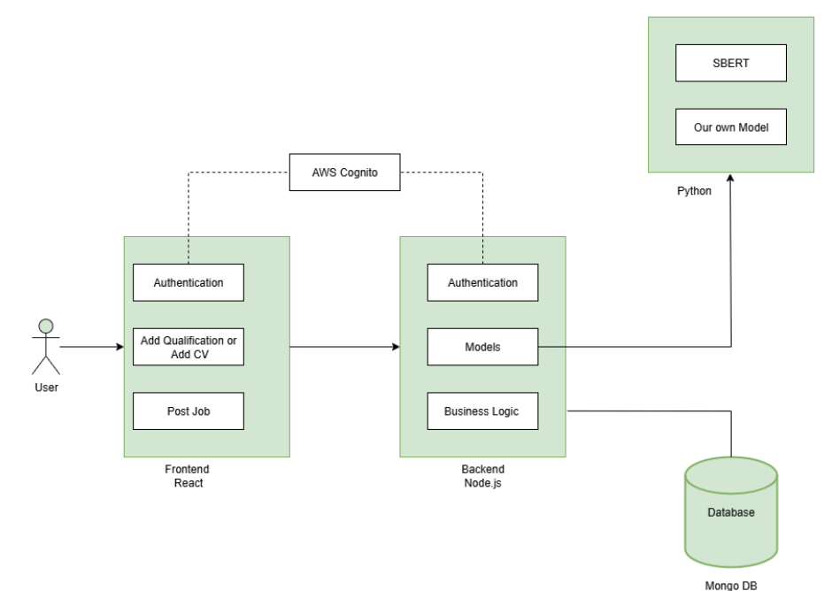

# 💼 Job Recommendation System using Machine Learning

This is a full-stack Job Recommendation System that predicts the top 5 job matches for a user based on their social media activity and compares it with current job postings. It uses machine learning to recommend the most suitable jobs.

## 🔧 Tech Stack

- **Frontend**: React (TypeScript)
- **Backend**: Node.js (Express)
- **Machine Learning**: Python
- **Authentication**: AWS Cognito
- **Database**: MongoDB (Atlas)

🔗 **GitHub Repo**: [Job-Recommended-System-Machine-Learning-](https://github.com/Sheshanadaf/Job-Recommended-System-Machine-Learning-)

---

## ⚙️ Features

- 🔐 Secure user authentication using AWS Cognito
- 🤖 Predicts matching jobs using ML
- 📄 Compares user profile with job postings
- 🧠 ML model trained on social media activity and job description data
- 📊 Returns **top 5 job recommendations**

---

## 🗂️ Project Structure

This project uses two branches in GitHub:

- `frontend1` – React (TypeScript) frontend
- `backend` – Node.js backend and ML integration

```bash
📁 Job-Recommended-System-Machine-Learning-/
├── frontend/                 # React (TypeScript) frontend (in `frontend1` branch)
├── backend/                  # Node.js backend (in `backend` branch)

```

---

## 🖼️ Architecture Diagram



---

## 🚀 Getting Started

### 1️⃣ Clone the Repository

```bash
git clone https://github.com/Sheshanadaf/Job-Recommended-System-Machine-Learning-.git
```

---

### 2️⃣ Setup Backend

```bash
git checkout backend       # Switch to backend branch
cd backend                 # Go to backend folder
touch .env                 # Create environment file
```

#### ✏️ Add the following to `.env`:

```
MONGO_URI=your_mongodb_connection_string
```

```bash
npm install                # Install dependencies
node index.js              # Start backend server
```

---

### 3️⃣ Setup Frontend

```bash
git checkout frontend1     # Switch to frontend branch
cd frontend                # Go to frontend folder
npm install                # Install dependencies
npm run dev                # Start frontend app
```

---

### 4️⃣ Run the Machine Learning Model (if needed separately)

```bash
cd backend/model
python model.py
```

---

## 📌 Requirements

- Node.js and npm
- Python 3.x
- MongoDB Atlas account
- AWS account with Cognito setup

---

## 📄 License

This project is licensed under the [MIT License](LICENSE).

---

## 👨‍💻 Author

- [Sheshan Hebron](https://github.com/Sheshanadaf)
