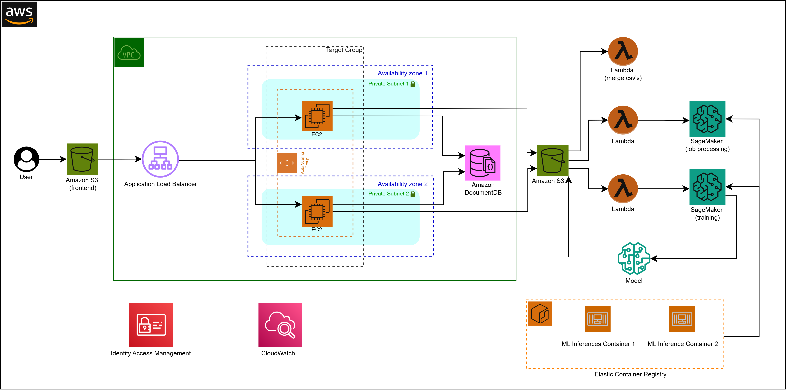
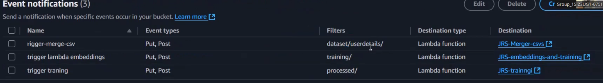

# Hosted a Machine Learning Application Completely on AWS

This project demonstrates how to host my **Machine Learning-based Job Recommendation System** fully on AWS infrastructure.
 **Note:** The main focus here is on AWS services and deployment, not the internal application architecture.

---

##  AWS Architecture Diagram


##  Technologies

### Frontend

* React + TypeScript

### Backend

* Node.js (running on port 3001)

### AWS Services

* **Amazon S3** (2 buckets: one for frontend hosting, one for ML model files)
* **Target Group** (forwarding traffic to port 3001)
* **Application Load Balancer (ALB)**
* **Launch Template**
* **Auto Scaling Group (ASG)**
* **Amazon EC2**
* **AWS Lambda**
* **Amazon SageMaker**
* **Amazon ECR (Elastic Container Registry)**
* **Amazon DocumentDB**

---

## 🎥 Demo Video

[Watch the demo](https://drive.google.com/drive/folders/1xreKe9RZGTG3EmFehaIFJWjBvm6uPbGq?usp=sharing)

---

## ✨ Application Features

* User login and authentication
* Companies can add job posts
* Users can upload CVs
* Train ML model to predict job categories
* Get top 5 matching jobs based on predictions

---

## 📂 Project Structure

```plaintext
.
├── 2 ECR Images/
│   ├── lambda-create-embeddings/
│   └── lambda-predict/
├── Backend/
├── Frontend/
├── lambda-files/
├── launching-template/
│   └── user_data
```

---

## ⚡ Deployment Instructions

Follow these steps to deploy the application completely on AWS:

### 1. Clone the Repository

```bash
gh repo clone Sheshanadaf/Job-Recommendation-System
cd Job-Recommendation-System
```

### 2. Setup Amazon DocumentDB

1. Go to AWS Console → **Amazon DocumentDB**.
2. Create a cluster.
3. Get the **connection URL** → referred to as **DB URL A**.

### 3. Create S3 Buckets

1. Create **Bucket A** → enable *Static Website Hosting* (for frontend).
2. Create **Bucket B** → for ML files and Lambda-triggered CSVs.

### 4. Launch Template & EC2 Setup

1. Go to **EC2 → Launch Templates**.
2. Create a new Launch Template and attach `launching-template/user_data` (file has given) to user data field in launch template.
3. Update environment variables (DocumentDB URL (DB URL A), S3 buckets, etc.) in user data.
4. Create **Auto Scaling Group (ASG)** using this template.
5. Create a **Target Group** → forward traffic to port 3001.
6. Create an **Application Load Balancer (ALB)** → get URL (**ALB URL A**).

### 5. Deploy Frontend

```bash
cd Frontend
npm install
# Update config.ts with ALB URL A
npm run build
```

* Upload `dist/` folder → **S3 Bucket A**
* Verify static hosting URL works.

### 6. Deploy Backend

1. Edit `Backend/index.js` → set allowed origin to **Bucket A** hosting URL.
2. Push backend code to GitHub.
3. Update environment variables in the Launch Template (DocumentDB URL, Bucket names).

### 7. Setup AWS Lambda Functions

#### CSV Merger Lambda

* Create Lambda: **JRS-Merger-csvs**
* Upload code: `lambda-files/JRS-Merger-csvs-index.js`
* Add environment variables:

  * `AWS_REGION`
  * `BUCKET_NAME` = Bucket B

#### Create ECR Images

1. Navigate to `2 ECR Images/`.
2. Build & push Docker images:

   * **ECR Image 1** → `lambda-create-embeddings/` (let's refer ecr image link as "ECR Image URI 1")
   * **ECR Image 2** → `lambda-predict/` (let's refer ecr image link as "ECR Image URI 2")
3. Note the ECR image URIs.

#### Embeddings & Training Lambda

* Create Lambda: **JRS-embeddings-and-training-lambda**
* Upload code: `lambda-files/JRS-embeddings-and-training-lambda_fuction.py`
* Environment variables:

  * `ECR_IMAGE_URI` = ECR Image URI 1
  * `SAGEMAKER_ROLE` = IAM role with SageMaker permissions
* Update `S3Uri` and `S3OutputPath`.

#### Training Lambda

* Create Lambda: **JRS-trainngi-lambda**
* Upload code: `lambda-files/JRS-trainngi-lambda_fuction.py`
* Same environment variables as above.

#### Prediction Lambda

* Create Lambda: **lambda-predict**
* Use **ECR Image URI 2** as container.

⚠️ Check SageMaker instance types in Lambda functions; update according to AWS region.

### 8. Configure S3 Event Notifications

* In **Bucket B → Properties → Event Notifications**, configure triggers for events.see the image blow

---



## Now see everythins is working.

## 🔧 Challenges & Learnings

* **Cognito Authentication** → Required HTTPS ALB.
* **Amplify Frontend Hosting** → HTTPS limitation with ALB.
* **No DevOps Tools** → Manual deployment instead of CI/CD pipelines.
* **SageMaker Knowledge Gap** → Needed extra learning for configuration.

---

## 👨‍💻 Author

Developed by **Sheshan Hebron**
Undergraduate - SLTC

```
```
